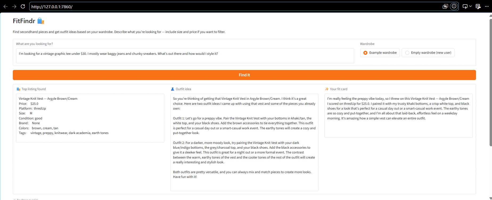

# FitFindr — Starter Kit

An AI-powered thrift shopping agent that takes a natural language query, finds matching secondhand listings, and generates a styled OOTD caption in one run.

---


## What's Included

<!-- ```
ai201-project2-fitfindr-starter/
├── data/
│   ├── listings.json          # 40 mock secondhand listings
│   └── wardrobe_schema.json   # Wardrobe format + example wardrobe
├── utils/
│   └── data_loader.py         # Helper functions for loading the data
├── planning.md                # Your planning template — fill this out first
└── requirements.txt           # Python dependencies
``` -->
```
ai201-project2-fitfindr-starter/
├── data/
│   ├── listings.json          # 40 mock secondhand listings
│   └── wardrobe_schema.json   # Wardrobe format + example wardrobe
├── utils/
│   └── data_loader.py         # Helper functions for loading data
├── tools.py                   # The three agent tools
├── agent.py                   # Planning loop and session management
├── app.py                     # Gradio web interface
├── tests/
│   └── test_tool.py           # Pytest tests for all three tools
└── planning.md                # Design spec and architecture
```
---

## Setup
Create and activate a virtual environment:
```bash
python -m venv .venv
```

Install the necessary libraries:
```bash
pip install -r requirements.txt
```

Set your Groq API key in a `.env` file (get a free key at [console.groq.com](https://console.groq.com)):
```
GROQ_API_KEY=your_key_here
```
Run the app:
```bash
python app.py
```

Then open the localhost URL shown in your terminal (usually `http://localhost:7860`).

---

## Tool Inventory

### `search_listings(description, size, max_price, session)`

Searches the mock listings database for secondhand items matching the user's query.

| Parameter | Type | Purpose |
|---|---|---|
| `description` | str | Natural language description of the item |
| `size` | str or None | Clothing size to filter by; None skips filtering |
| `max_price` | float or None | Maximum price to filter by; None skips filtering |
| `session` | dict or None | Session dict; receives error message on empty results |

Returns a list of matching listing dicts sorted by relevance score (highest first), or an empty list if nothing matches. Sets `session["error"]` and returns early without raising an exception if results are empty.

---

### `suggest_outfit(new_item, wardrobe, client)`

Uses an LLM to suggest up to 2 outfit combinations for a thrifted item.

| Parameter | Type | Purpose |
|---|---|---|
| `new_item` | dict | The listing dict for the item being considered |
| `wardrobe` | dict | Wardrobe dict with an `"items"` key containing a list of item dicts |
| `client` | Groq | Initialized Groq client |

Returns a string with outfit suggestions. If the wardrobe is empty, returns general styling advice instead of referencing specific pieces. Never returns an empty string and never raises an exception.

---

### `create_fit_card(outfit, new_item, client)`

Uses an LLM to generate a short, shareable OOTD caption for a thrifted item.

| Parameter | Type | Purpose |
|---|---|---|
| `outfit` | str | Outfit suggestion string from `suggest_outfit` |
| `new_item` | dict | The listing dict for the thrifted item |
| `client` | Groq | Initialized Groq client |

Returns a 2–4 sentence caption string styled like a real Instagram/TikTok post, mentioning the item name, price, and platform once each. If `outfit` is empty or whitespace-only, returns a descriptive error message string instead of raising an exception.

---

## How the Planning Loop Works

The agent runs three tools in a fixed sequence for every interaction. It does not decide which tool to call based on context — it always calls them in order: `search_listings` → `suggest_outfit` → `create_fit_card`. The only decision point is after `search_listings`: if no listings match, the agent sets an error message in the session and returns early without calling the remaining tools.

**Step 1 — Parse the query.** The agent uses regex to extract `max_price` (e.g. `$30` → `30.0`) and `size` (e.g. `size M` → `"M"`) from the raw query string. The full query is used as the `description` for keyword scoring. No LLM call is made for parsing — regex is sufficient for these predictable patterns and avoids an unnecessary API call.

**Step 2 — Search listings.** `search_listings` loads all 40 mock listings, filters by size and price if provided, scores each remaining listing by keyword overlap with the description, drops zero-score listings, and returns the list sorted highest score first. If the list is empty, the agent exits here.

**Step 3 — Suggest outfit.** `suggest_outfit` receives the top listing from step 2 and the user's wardrobe. If the wardrobe has items, it asks the LLM to suggest specific outfit combinations using named wardrobe pieces. If the wardrobe is empty, it asks the LLM for general styling advice instead.

**Step 4 — Create fit card.** `create_fit_card` receives the outfit suggestion string and the listing dict. It validates the outfit string (strips whitespace), builds a prompt with the item name, price, platform, and outfit details, and asks the LLM for a casual 2–4 sentence OOTD caption at a higher temperature for variation.

---

## State Management

The agent uses a single session dict initialized at the start of each run by `_new_session()`. Every tool writes its output into the session before the next tool is called — no tool re-prompts the user or fetches data independently.

| Session key | Set by | Read by |
|---|---|---|
| `session["parsed"]` | `run_agent` (regex) | `search_listings` call |
| `session["search_results"]` | `search_listings` | `run_agent` to select top item |
| `session["selected_item"]` | `run_agent` | `suggest_outfit`, `create_fit_card` |
| `session["outfit_suggestion"]` | `suggest_outfit` | `create_fit_card` |
| `session["fit_card"]` | `create_fit_card` | returned to user |
| `session["error"]` | `search_listings` (on empty) | `run_agent` early return check |

If `session["error"]` is not None after `search_listings`, the agent returns immediately and `session["outfit_suggestion"]` and `session["fit_card"]` remain None.

---

## Error Handling

Each tool has one defined failure mode. All failures return informative strings — none raise exceptions.

| Tool | Failure mode | What the agent actually does |
|---|---|---|
| `search_listings` | No listings match the query | Sets `session["error"]` to `"No listings found matching '<description>' under $<price> in size <size>. Try broadening your search."` and returns an empty list. The agent exits early and the error message is shown in the UI's first panel. |
| `suggest_outfit` | Wardrobe is empty | Calls the LLM with a different prompt asking for general styling advice — e.g. what silhouettes, colors, and aesthetics pair well with the item. Returns a non-empty string. Never crashes. |
| `create_fit_card` | Outfit string is empty or whitespace-only | Returns `"Could not generate a fit card: the outfit suggestion for '<item name>' was empty or incomplete. Try running suggest_outfit again."` without calling the LLM. |


### Concrete examples from testing

**`search_listings` empty results:**
```bash
python -c "from tools import search_listings; print(search_listings('designer ballgown', size='XXS', max_price=5))"
# Output: []
```

**`create_fit_card` empty outfit:**
```bash
# Returns: "Could not generate a fit card: the outfit suggestion for 'Vintage Graphic Tee'
# was empty or incomplete. Try running suggest_outfit again."
```

**Full agent no-results path:**
```bash
python agent.py
# Output: "No listings found matching 'designer ballgown size XXS under $5' under $5.0 in size XXS.
# Try broadening your search."
```
Example Test Case <!-- From the planning.md file -->


---

## AI Usage

### Instance 1 — Implementing `search_listings`

I gave Claude the `search_listings` spec block from `planning.md` (inputs, return value, failure mode) and the listings schema (all 11 fields). I asked it to implement the function using `load_listings()` from the data loader, filtering by `max_price` and `size`, scoring by keyword overlap with `description`, and returning early with a session error on empty results.

Claude produced a working implementation. Before using it I verified: the price and size filters used `None` checks correctly, the score function included title, description, and style_tags in its keyword bag, and the early-return branch set `session["error"]` rather than raising an exception. I then ran three test queries (one with results, one price-filtered to empty, one with a nonsense description) and confirmed all three behaved as specified.

### Instance 2 — Implementing `create_fit_card`

I gave Claude the `create_fit_card` spec from `planning.md` (inputs: `outfit`, `new_item`; validation: strip whitespace; output: 2–4 sentence OOTD caption; requirements: mentions item name/price/platform once each, casual tone, higher temperature) and the corresponding node from my Architecture diagram.

Claude produced the function including the validation branch and a prompt with explicit rules for the LLM (mention each field exactly once, avoid generic openers like "Obsessed with"). I verified the temperature was set to 0.95 (above the default), the fallback branch returned a string without calling the LLM, and the prompt included the item name, price, and platform as variables. I ran it three times on the same input to confirm the captions varied, then tested the empty-string and whitespace-only cases.

Also received help with updating and completing my .md files and code troubleshooting.

---

## Running Tests

```bash
python -m pytest tests/
```

All 8 tests should pass. Tests cover: `search_listings` returning results, empty results, and price filtering; `suggest_outfit` with empty and non-empty wardrobes; `create_fit_card` with empty outfit, whitespace-only outfit, and valid input.

---


## Spec Reflection

The planning process caught two things that would have caused bugs without it.

First, the wardrobe empty case in `suggest_outfit`. Without specifying the two prompt branches upfront, the natural implementation would have tried to format an empty list into a prompt and either crashed or asked the LLM to suggest outfits using nothing. The spec forced the decision: if empty, switch to a general styling prompt entirely.

Second, the early return in `search_listings`. The spec required setting `session["error"]` and returning an empty list rather than raising an exception. Without that explicit requirement, the natural implementation would have let the empty list propagate into `suggest_outfit`, which would have called the LLM with a None item and either crashed or produced nonsense output.


## The Mock Listings Dataset

`data/listings.json` contains 40 mock secondhand listings across categories (tops, bottoms, outerwear, shoes, accessories) and styles (vintage, y2k, grunge, cottagecore, streetwear, and more).

Each listing has: `id`, `title`, `description`, `category`, `style_tags`, `size`, `condition`, `price`, `colors`, `brand`, and `platform`.

Load it with:
```python
from utils.data_loader import load_listings
listings = load_listings()
```

## The Wardrobe Schema

`data/wardrobe_schema.json` defines the format your agent uses to represent a user's existing wardrobe. It includes:

- `schema`: field definitions for a wardrobe item
- `example_wardrobe`: a sample wardrobe with 10 items you can use for testing
- `empty_wardrobe`: a starting template for a new user

Load an example wardrobe with:
```python
from utils.data_loader import get_example_wardrobe
wardrobe = get_example_wardrobe()
```

<!-- ## Where to Start

1. **Read `planning.md` and fill it out before writing any code.**
2. Verify the data loads correctly by running `python utils/data_loader.py`.
3. Build and test each tool individually before connecting them through your planning loop.

Your implementation files go in this same directory. There's no required file structure for your agent code — organize it however makes sense for your design. -->

<!-- Tests for demo:

    1. vintage graphic tee under $30
        with wardrobe
        with no wardrobe
        
    2. in terminal:
        python -c "from tools import search_listings; print(search_listings('designer ballgown', size='XXS', max_price=5))"
        
    3. designer ballgown size XXS under $5
        with wardrobe
        with no wardrobe -->